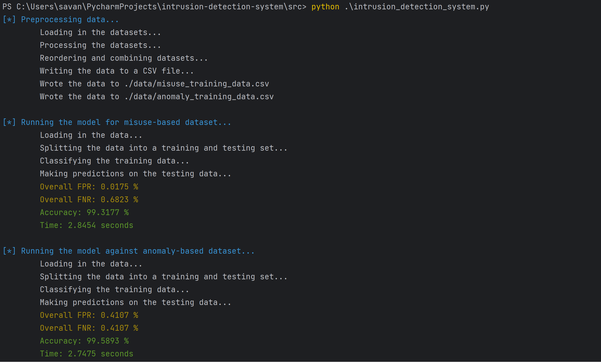

# Intrusion Detection System


## Description
intrusion_detection_system.py uses misuse-based (signature-based) and anomaly-based detection to classify packet
information from the NSL-KDD dataset. These were classified by using a decision tree, a supervised learning algorithm.

## Project Structure
```
Intrusion Detection System
│   README.md
│   ...
│
└───data
│   │   anomaly_training_data.csv*
│   │   misuse_training_data.csv*
│   │   test.csv
│   │   train.csv
│
└───src
    │   decision_tree.py
    │   intrusion_detection_system.py
    │   preprocessing.py
    │   requirements.txt        
    │
    └───output
        │   anomaly_confusion_matrix.csv*
        │   anomaly_rates.txt*
        │   misuse_confusion_matrix.csv*
        │   misuse_rates.txt*
        │
```

## Getting Started

### Dependencies
* Python3
* Colorama 
* Termcolor
* Pandas
* Sklearn
* Psutil

### Installing
```
# Clone this repository
$ git clone https://github.com/sea7321/intrusion-detection-system.git

# Go into the repository
$ cd intrusion-detection-system

# Install dependencies
$ pip install -r requirements.txt
```

### Executing program

```
# Run the intrusion detection system
$ python3 intrusion_detection_system.py
```

## Authors
* Savannah Alfaro, sea2985@rit.edu
* Aaron Kersten, amk9398@rit.edu