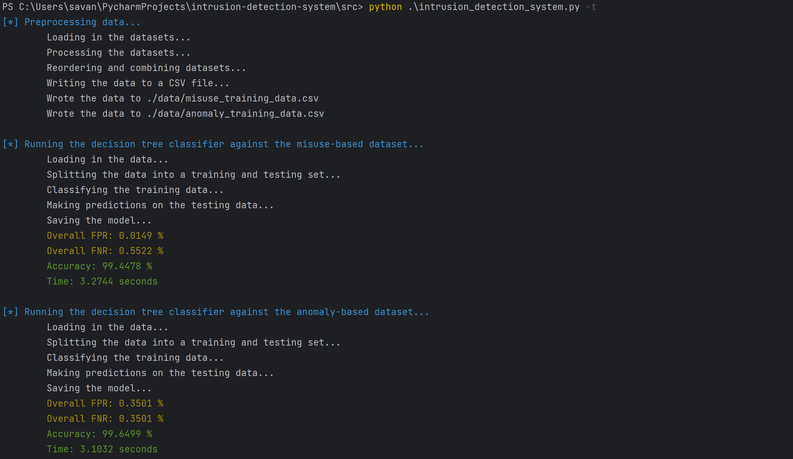
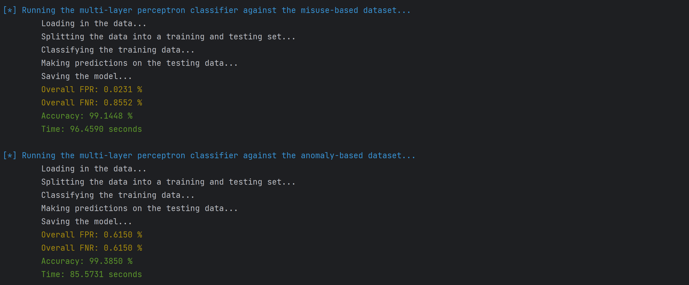
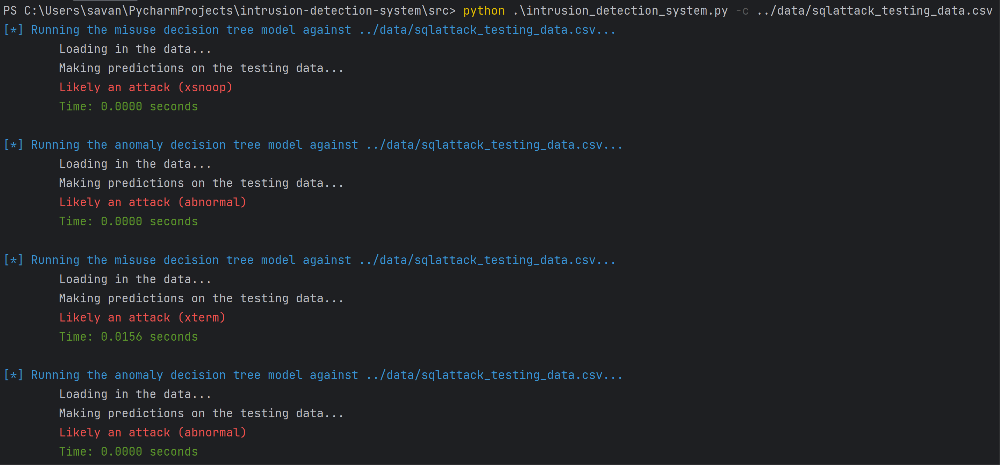

# Intrusion Detection System


## Description
intrusion_detection_system.py uses misuse-based (signature-based) and anomaly-based detection to classify packet
information from the NSL-KDD dataset (https://www.kaggle.com/datasets/hassan06/nslkdd). These are classified by using a
decision tree and a multilayer perceptron, two supervised learning algorithms.

## Project Structure
```
Intrusion Detection System
│   README.md
│   ...
│
└───data
│   │   anomaly_training_data.csv*
│   │   misuse_training_data.csv*
│   │   sqlattack_testing_data.csv
│   │   test.csv
│   │   train.csv
│   │   udpstorm_testing_data.csv
│
└───src
    │   classify.py
    │   intrusion_detection_system.py
    │   preprocessing.py
    │   requirements.txt
    │   train.py     
    │
    └───models
    │   │   dt_anomaly_model.pickle
    │   │   dt_misuse_model.pickle
    │   │   mlp_anomaly_model.pickle
    │   │   mlp_misuse_model.pickle
    │
    └───output
    │   │   dt_anomaly_confusion_matrix.csv
    │   │   dt_anomaly_rates.txt
    │   │   dt_misuse_confusion_matrix.csv
    │   │   dt_misuse_rates.txt
    │   │   ...
    │   
```

## Getting Started

### Dependencies
* Python3
* Colorama 
* Termcolor
* Pandas
* Scikit-learn
* Psutil
* Pickle

### Installing
```
# Clone this repository
$ git clone https://github.com/sea7321/intrusion-detection-system.git

# Go into the repository
$ cd intrusion-detection-system

# Install dependencies
$ pip install -r requirements.txt
```

### Executing program

```
# Run the intrusion detection system
$ python3 intrusion_detection_system.py [-h] [-t] [-c CLASSIFY]
```

## Train Example

```
# Create, train, and save the models 
$ python3 intrusion_detection_system.py -t
```

### Decision Tree


### Multilayer Perceptron


## Classify Example

```
# Classify new attack data on pre-saved models
$ python3 intrusion_detcdection_system.py -c <test_filename>
$ python3 intrusion_detection_system.py -c ../data/sqlattack_testing_data.csv
```


## Authors
* Savannah Alfaro, sea2985@rit.edu
* Aaron Kersten, amk9398@rit.edu